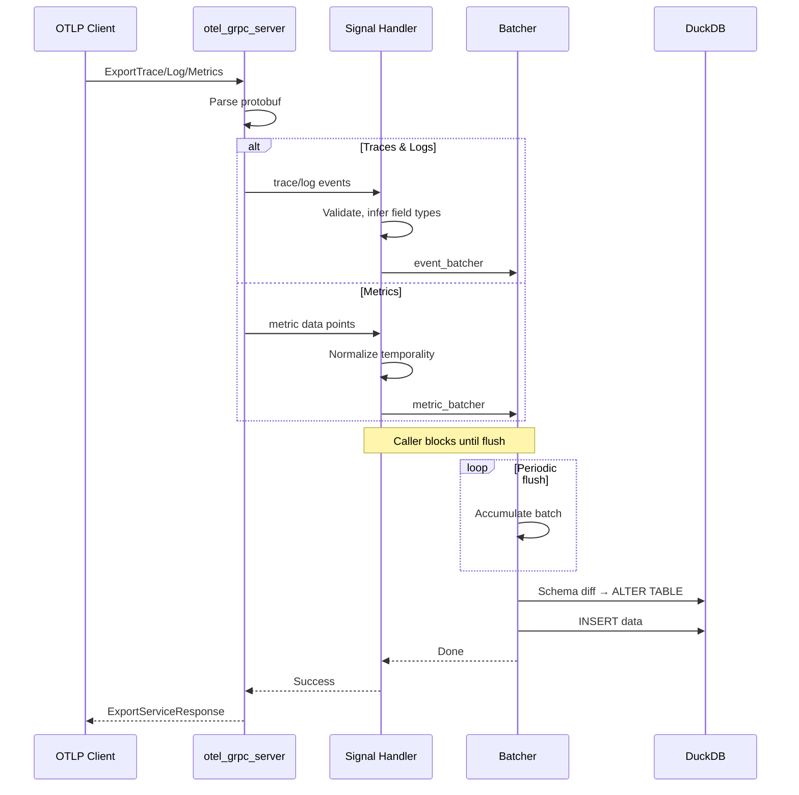

# O11yLite

O11yLite is a lightweight observability engine that speaks OpenTelemetry.

It's designed to work as a single process.

The analytics engine is powered by DuckDB and SQLite.

## Components

### Backend (`backend/`)

A Clojure service, the core of O11yLite.

* Handles telemetry ingestion via OTLP/gRPC and OTLP/HTTP
* Operates SQLite and DuckDB with automatic schema evolution
* Functions as Inertia.js backend, serving HTML with embedded page data
* Integrant component system for lifecycle management
* Runs entirely on Java virtual threads

#### Ingestion Pipeline



**Type System** (`store/schema.clj`): Normalizes types between Clojure values, DuckDB columns, and the application layer (`:string`, `:instant`, `:integer`, `:float`, `:boolean`).

**Schema Evolution**: New fields in events automatically create columns. The `event_metadata` cache tracks known fields; `persist-batch!` diffs incoming fields against the cache and runs `ALTER TABLE ADD COLUMN` as needed.

#### Signal Support

The backend ingests all three OpenTelemetry signals via OTLP/gRPC and OTLP/HTTP:

- **Events (Traces & Logs)** - Unified event concept that supports both trace spans and log records with shared storage, schema evolution, and querying via `store/events/`
- **Metrics** - Dedicated metrics pipeline (`store/metrics/`) supporting gauges, counters, and histograms with delta/cumulative temporality handling

#### HTTP Routes

The backend serves two types of HTTP routes:

- **Page routes** (`routes/`) - Inertia.js responses for UI pages. Primary client-server interaction happens via Inertia, which handles page navigation, form submissions, and state management.
- **API routes** (`api/`) - JSON endpoints for telemetry queries. Used by the frontend via Ajax (TanStack Query) for real-time data fetching where Inertia's request/response cycle isn't suitable.

#### Key Directories

- **`components/`** - Integrant lifecycle components (web server, routers, batchers, connection pools)
- **`api/`** - JSON API endpoints for queries and metadata
- **`routes/`** - Inertia.js page routes (explore, trace, dashboards, monitors)
- **`store/`** - Data storage layer with `events/` (unified logs/traces) and `metrics/` subsystems
- **`otel_grpc/`** - OTLP protocol handlers for all three signals

### Frontend (`frontend/`)

An Inertia.js React frontend built with Vite + TypeScript + Tailwind CSS.

Uses [shadcn/ui](https://ui.shadcn.com/) (New York style) for UI components with Lucide icons.

- **`pages/`** - Page components mapped to routes (Explore, Trace, Dashboards, Monitors)
- **`components/`** - Reusable components including query-builder, results views, and trace visualization
- **`components/ui/`** - shadcn/ui primitives

Route handlers return Inertia responses that reference page components by name:
```clojure
;; backend - returns {:component "Home" :props {...}}
(response/inertia "Home" {:greeting "Welcome"})
```
```tsx
// frontend/src/pages/Home.tsx - receives props
export default function Home({ greeting }: { greeting: string }) {
  return <h1>{greeting}</h1>
}
```

## Distributions

We bundle everything to a single docker image, using s6 overlay.

## Development

### Dev Architecture

```
┌─────────────────────────────────────────────────────────────┐
│                         Caddy                               │
│                  (reverse proxy, TLS)                       │
├─────────────────────────────────────────────────────────────┤
│  /frontend/*  │  /*  (everything else)                      │
│       ↓       │           ↓                                 │
│    ┌──────┐   │   ┌────────────┐                            │
│    │ Vite │   │   │  Clojure   │                            │
│    │ :5173│   │   │  Backend   │                            │
│    └──────┘   │   │   :3000    │                            │
│               │   └────────────┘                            │
└─────────────────────────────────────────────────────────────┘
```

- **Caddy** - Reverse proxy at `https://o11ylite.localhost`, routes `/frontend/*` to Vite
- **Vite** - Dev server with HMR for frontend assets
- **Backend** - Clojure/Ring/Reitit server, serves Inertia.js HTML responses

### First time running

Install the required tools (Java, Clojure, Node.js) using [mise](https://mise.jdx.dev/) or [asdf](https://asdf-vm.com/) with the versions specified in `.tool-versions`:

```bash
mise install  # or: asdf install
```

Then run `dev/setup` to install all necessary dependencies for the project.

### Quick Start

Start all services locally:
```bash
dev/start all
```
Visit `https://o11ylite.localhost`

### REPL-Driven Development

For backend development with REPL:
```bash
dev/start          # Starts Caddy, Vite, and nREPL server
```

Then connect your editor to the REPL and:
```clojure
;; In backend/dev/user.clj
(go)               ;; Start the system
(reset)            ;; Restart after code changes
(halt)             ;; Stop the system
```

### Running Services Individually

```bash
# Frontend (Vite dev server)
cd frontend && npm run dev

# Backend
cd backend && clojure -M:run/dev

# Caddy (uses dev/Caddyfile)
caddy run --config dev/Caddyfile
```

### Environment Variables

| Variable | Default | Description |
|----------|---------|-------------|
| `O11YLITE_DEV` | - | Set to enable dev mode (uses Vite HMR) |
| `O11YLITE_WEB_PORT` | 3000 | Backend server port |
| `O11YLITE_WEB_HOST` | 0.0.0.0 | Backend server host |
| `O11YLITE_ASSET_BASE_URL` | /frontend | Base URL for frontend assets |


### Multiple Dev Environments

You can run multiple dev environments on the same host by configuring unique ports and hostnames per instance. This is useful when working on multiple branches or features simultaneously.

Create a `.envrc` in each repository clone:

```bash
export O11YLITE_DEV_HOSTNAME="o11ylite-feature-a.localhost"  # default: o11ylite.localhost
export DEV_HTTPS_PORT=8443     # default: 443
export O11YLITE_WEB_PORT=3010  # default: 3000
export VITE_PORT=5180          # default: 5173
export O11YLITE_OTEL_GRPC_PORT=4320  # default: 4317
```

Then run `dev/setup` to add the hostname to `/etc/hosts`, and `dev/start` to launch.

Access at `https://o11ylite-feature-a.localhost:8443`

### Building for Production

```bash
# Build frontend assets
cd frontend && npm run build

# Copy manifest to backend resources for prod deployment
cp -r frontend/dist/.vite backend/resources/
```

