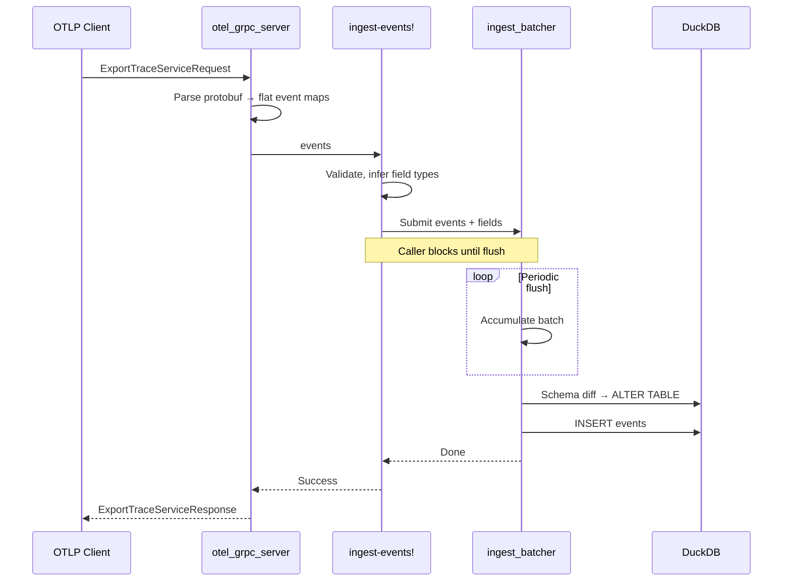

# O11yLite

O11yLite is a lightweight observability engine that speaks OpenTelemetry.

It's designed to work as a single process.

The analytics engine is powered by DuckDB and SQLite.

## Components

### Backend (`backend/`)

A Clojure service, the core of O11yLite.

* Handles telemetry ingestion via OTLP/gRPC
* Operates SQLite and DuckDB with automatic schema evolution
* Functions as Inertia.js backend, serving HTML with embedded page data
* Integrant component system for lifecycle management
* Runs entirely on Java virtual threads

#### Ingestion Pipeline



**Type System** (`store/schema.clj`): Normalizes types between Clojure values, DuckDB columns, and the application layer (`:string`, `:instant`, `:integer`, `:float`, `:boolean`).

**Schema Evolution**: New fields in events automatically create columns. The `event_metadata` cache tracks known fields; `persist-batch!` diffs incoming fields against the cache and runs `ALTER TABLE ADD COLUMN` as needed.

#### HTTP Routes

The backend serves two types of HTTP routes:

- **Page routes** (`routes/`) - Inertia.js responses for UI pages. Primary client-server interaction happens via Inertia, which handles page navigation, form submissions, and state management.
- **API routes** (`api/`) - JSON endpoints for telemetry queries. Used by the frontend via Ajax (TanStack Query) for real-time data fetching where Inertia's request/response cycle isn't suitable.

#### Key Directories

```
backend/
├── src/o11ylite/
│   ├── system.clj           # Integrant system config & lifecycle
│   ├── components/          # Integrant components
│   │   ├── web_server.clj   #   Jetty HTTP server
│   │   ├── router.clj       #   Reitit routes
│   │   ├── inertia.clj      #   Inertia.js config
│   │   ├── otel_grpc_server.clj  # OTLP/gRPC server
│   │   ├── ingest_batcher.clj    # Batched ingestion with backpressure
│   │   ├── event_metadata.clj    # Field metadata cache
│   │   ├── duckdb_pool.clj       # DuckDB connection pool
│   │   └── sqlite_pool.clj       # SQLite connection pool
│   ├── api/                 # JSON API endpoints
│   │   └── health.clj       #   Health check endpoints
│   ├── routes/              # Inertia page routes
│   │   ├── home.clj         #   Home (redirects to /explore)
│   │   ├── explore.clj      #   Explore page
│   │   ├── dashboards.clj   #   Dashboards page
│   │   └── monitors.clj     #   Monitor rules & notifications
│   ├── store/               # Telemetry data storage layer
│   │   ├── schema.clj       #   Type system & introspection
│   │   ├── events/          #   Event ingestion & query
│   │   └── metrics/         #   Metrics ingestion & query
│   ├── otel_grpc/           # OTLP protocol handling
│   │   ├── proto.clj        #   Protobuf utilities
│   │   ├── trace.clj        #   Trace signal processing
│   │   └── log.clj          #   Log signal processing
│   ├── inertia/             # Inertia.js adapter
│   └── util/
│       ├── response.clj     #   Response helpers
│       └── ticker.clj       #   Go-style ticker for periodic tasks
└── resources/
    └── system.edn           # System configuration (Aero)
```

### Frontend (`frontend/`)

An Inertia.js React frontend built with Vite + TypeScript + Tailwind CSS.

Uses [shadcn/ui](https://ui.shadcn.com/) (New York style) for UI components with Lucide icons.

```
frontend/
├── src/
│   ├── main.tsx             # Inertia app entry point
│   ├── index.css            # Global styles & Tailwind config
│   ├── pages/               # Page components (matched by name)
│   │   └── Home.tsx
│   ├── components/
│   │   ├── layouts/         # Page layout wrappers
│   │   │   └── application-layout.tsx
│   │   ├── ui/              # shadcn/ui primitives (don't modify, keep upstream-compatible)
│   │   ├── app-sidebar.tsx  # Application sidebar
│   │   └── search-form.tsx  # Search component
│   ├── hooks/
│   │   └── use-mobile.ts    # Mobile detection hook
│   └── lib/
│       └── utils.ts         # cn() helper for class merging
├── public/
│   └── favicon.svg          # Static assets
├── components.json          # shadcn/ui configuration
└── vite.config.ts           # Vite config (base: /frontend)
```

Route handlers return Inertia responses that reference page components by name:
```clojure
;; backend - returns {:component "Home" :props {...}}
(response/inertia "Home" {:greeting "Welcome"})
```
```tsx
// frontend/src/pages/Home.tsx - receives props
export default function Home({ greeting }: { greeting: string }) {
  return <h1>{greeting}</h1>
}
```

## Distributions

We bundle everything to a single docker image, using s6 overlay.

## Development

### Dev Architecture

```
┌─────────────────────────────────────────────────────────────┐
│                         Caddy                               │
│                  (reverse proxy, TLS)                       │
├─────────────────────────────────────────────────────────────┤
│  /frontend/*  │  /*  (everything else)                      │
│       ↓       │           ↓                                 │
│    ┌──────┐   │   ┌────────────┐                            │
│    │ Vite │   │   │  Clojure   │                            │
│    │ :5173│   │   │  Backend   │                            │
│    └──────┘   │   │   :3000    │                            │
│               │   └────────────┘                            │
└─────────────────────────────────────────────────────────────┘
```

- **Caddy** - Reverse proxy at `https://o11ylite.localhost`, routes `/frontend/*` to Vite
- **Vite** - Dev server with HMR for frontend assets
- **Backend** - Clojure/Ring/Reitit server, serves Inertia.js HTML responses

### Quick Start

First time running you need to install this first: [Practicalli Clojure CLI Config](https://practical.li/clojure/clojure-cli/practicalli-config/).

Start all services locally:
```bash
dev/start all
```
Visit `https://o11ylite.localhost`

### REPL-Driven Development

For backend development with REPL:
```bash
dev/start          # Starts Caddy, Vite, and nREPL server
```

Then connect your editor to the REPL and:
```clojure
;; In backend/dev/user.clj
(go)               ;; Start the system
(reset)            ;; Restart after code changes
(halt)             ;; Stop the system
```

### Running Services Individually

```bash
# Frontend (Vite dev server)
cd frontend && npm run dev

# Backend
cd backend && clojure -M:run/dev

# Caddy (uses dev/Caddyfile)
caddy run --config dev/Caddyfile
```

### Environment Variables

| Variable | Default | Description |
|----------|---------|-------------|
| `O11YLITE_DEV` | - | Set to enable dev mode (uses Vite HMR) |
| `PORT` | 3000 | Backend server port |
| `HOST` | 0.0.0.0 | Backend server host |
| `ASSET_BASE_URL` | /frontend | Base URL for frontend assets |


### Multiple Dev Environments

You can run multiple dev environments on the same host by configuring unique ports and hostnames per instance. This is useful when working on multiple branches or features simultaneously.

Create a `.envrc` in each repository clone:

```bash
export O11YLITE_DEV_HOSTNAME="o11ylite-feature-a.localhost"  # default: o11ylite.localhost
export DEV_HTTPS_PORT=8443     # default: 443
export PORT=3010               # default: 3000
export VITE_PORT=5180          # default: 5173
export OTEL_GRPC_PORT=4320     # default: 4317
```

Then run `dev/setup` to add the hostname to `/etc/hosts`, and `dev/start` to launch.

Access at `https://o11ylite-feature-a.localhost:8443`

### Running Testings

Please read `backend/README.md` and `frontend/README.md`

### Building for Production

```bash
# Build frontend assets
cd frontend && npm run build

# Copy manifest to backend resources for prod deployment
cp -r frontend/dist/.vite backend/resources/
```

