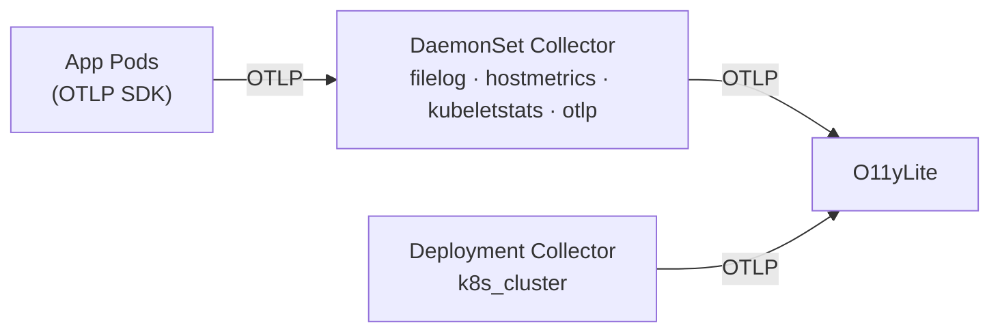
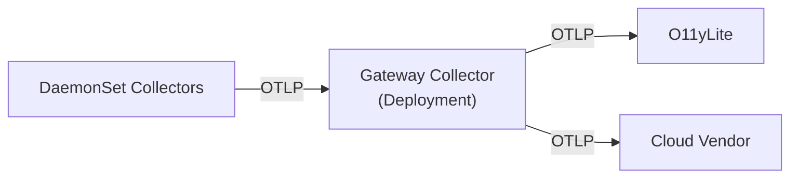

# Kubernetes OpenTelemetry Setup

This guide sets up OpenTelemetry collectors to collect logs, metrics, and traces from your Kubernetes cluster into O11yLite.

Two collectors work together:

- A **DaemonSet collector** runs on every node. It tails container stdout/stderr logs, collects host and kubelet metrics (including volume usage), and accepts OTLP from SDK-instrumented apps.
- A **Deployment collector** (single replica) watches the Kubernetes API server for cluster-state metrics: pod phases, deployment replica counts, node conditions, and more.

Both forward telemetry directly to O11yLite.

## Topology



O11yLite accepts OTLP natively on a single port, so both collectors forward directly to O11yLite with no intermediary gateway layer in between.

## Prerequisites

This guide assumes you have:

1. A running O11yLite instance in your cluster, deployed via Helm (see [Installation](installation.md)).
2. The [OpenTelemetry Operator](https://opentelemetry.io/docs/platforms/kubernetes/operator/) installed in your cluster.

The YAML examples throughout this guide use `o11ylite.o11ylite:80` as the O11yLite endpoint. This assumes the default Helm install: a Service named `o11ylite` in the `o11ylite` namespace on port `80`. Adjust this to match your actual Service name and namespace.

Install the Operator:

```bash
helm repo add open-telemetry https://open-telemetry.github.io/opentelemetry-helm-charts
helm install opentelemetry-operator open-telemetry/opentelemetry-operator \
  --namespace opentelemetry --create-namespace
```

## RBAC

The Operator does **not** create RBAC for collector pods. You must create ClusterRoles manually. ServiceAccount names follow the Operator's naming convention: `<collector-cr-name>-collector`.

<details>
<summary>DaemonSet RBAC (pods, nodes, replicasets for k8s_attributes and kubeletstats)</summary>

```yaml
apiVersion: rbac.authorization.k8s.io/v1
kind: ClusterRole
metadata:
  name: otel-collector-daemonset
rules:
  - apiGroups: [""]
    resources: [pods, nodes, nodes/stats]
    verbs: [get, list, watch]
  - apiGroups: [apps]
    resources: [replicasets]
    verbs: [get, list, watch]
---
apiVersion: rbac.authorization.k8s.io/v1
kind: ClusterRoleBinding
metadata:
  name: otel-collector-daemonset
roleRef:
  apiGroup: rbac.authorization.k8s.io
  kind: ClusterRole
  name: otel-collector-daemonset
subjects:
  - kind: ServiceAccount
    name: otel-collector-daemonset-collector
    namespace: opentelemetry
```

</details>

<details>
<summary>Deployment RBAC (broad read access for k8s_cluster receiver)</summary>

```yaml
apiVersion: rbac.authorization.k8s.io/v1
kind: ClusterRole
metadata:
  name: otel-collector-cluster
rules:
  - apiGroups: [""]
    resources:
      - events
      - namespaces
      - namespaces/status
      - nodes
      - nodes/spec
      - pods
      - pods/status
      - replicationcontrollers
      - replicationcontrollers/status
      - resourcequotas
      - services
    verbs: [get, list, watch]
  - apiGroups: [apps]
    resources: [daemonsets, deployments, replicasets, statefulsets]
    verbs: [get, list, watch]
  - apiGroups: [batch]
    resources: [jobs, cronjobs]
    verbs: [get, list, watch]
  - apiGroups: [autoscaling]
    resources: [horizontalpodautoscalers]
    verbs: [get, list, watch]
---
apiVersion: rbac.authorization.k8s.io/v1
kind: ClusterRoleBinding
metadata:
  name: otel-collector-cluster
roleRef:
  apiGroup: rbac.authorization.k8s.io
  kind: ClusterRole
  name: otel-collector-cluster
subjects:
  - kind: ServiceAccount
    name: otel-collector-cluster-collector
    namespace: opentelemetry
```

</details>

## API Key (Optional)

If you have API key authentication enabled on O11yLite (see [Authentication](authentication.md)), store the key in a Kubernetes Secret. The collector manifests below reference this secret. If you don't use API key auth, remove the `O11YLITE_API_KEY` env var and the `headers` block from the exporter.

<details>
<summary>Create the secret</summary>

Include the `Bearer ` prefix in the value so the collector can use it directly as the `authorization` header:

```bash
kubectl create secret generic o11ylite-api-key \
  --namespace opentelemetry \
  --from-literal=api-key="Bearer o11y_your_key_here"
```

</details>

## DaemonSet Collector

Apply the following `OpenTelemetryCollector` resource. It runs a collector pod on every node that collects pod logs, node/volume metrics, and kubelet stats, then exports to O11yLite.

```yaml
apiVersion: opentelemetry.io/v1beta1
kind: OpenTelemetryCollector
metadata:
  name: otel-collector-daemonset
  namespace: opentelemetry
spec:
  mode: daemonset
  trafficDistribution: PreferSameNode
  volumeMounts:
    - name: varlogpods
      mountPath: /var/log/pods
      readOnly: true
  volumes:
    - name: varlogpods
      hostPath:
        path: /var/log/pods
  env:
    - name: K8S_NODE_NAME
      valueFrom:
        fieldRef:
          fieldPath: spec.nodeName
    - name: K8S_NODE_IP
      valueFrom:
        fieldRef:
          fieldPath: status.hostIP
    - name: O11YLITE_API_KEY
      valueFrom:
        secretKeyRef:
          name: o11ylite-api-key
          key: api-key
  config:
    receivers:
      otlp:
        protocols:
          grpc:
            endpoint: 0.0.0.0:4317
          http:
            endpoint: 0.0.0.0:4318
      filelog:
        include:
          - /var/log/pods/*/*/*.log
        exclude:
          - /var/log/pods/*/otc-container/*.log
        include_file_path: true
        include_file_name: false
        operators:
          - type: container
          - type: json_parser
            if: 'body matches "^\\{"'
      hostmetrics:
        collection_interval: 15s
        scrapers:
          cpu: {}
          memory: {}
          disk: {}
      kubeletstats:
        collection_interval: 15s
        auth_type: serviceAccount
        endpoint: https://${env:K8S_NODE_IP}:10250
        insecure_skip_verify: true
        metric_groups:
          - node
          - pod
          - container
          - volume

    processors:
      batch:
        timeout: 5s
        send_batch_size: 10000
      memory_limiter:
        check_interval: 1s
        limit_mib: 512

      # For OTLP pipelines: match pods by sender IP (default behavior).
      k8s_attributes:
        passthrough: false
        filter:
          node_from_env_var: K8S_NODE_NAME
        extract:
          metadata:
            - k8s.pod.name
            - k8s.namespace.name
            - k8s.container.name
            - k8s.deployment.name
            - k8s.statefulset.name
            - k8s.daemonset.name
            - k8s.node.name
          labels:
            - tag_name: app.kubernetes.io/name
              key: app.kubernetes.io/name

      # For filelog: match pods by k8s.pod.uid extracted from log file path.
      k8s_attributes/filelog:
        passthrough: false
        filter:
          node_from_env_var: K8S_NODE_NAME
        pod_association:
          - sources:
              - from: resource_attribute
                name: k8s.pod.uid
        extract:
          metadata:
            - k8s.pod.name
            - k8s.namespace.name
            - k8s.container.name
            - k8s.deployment.name
            - k8s.statefulset.name
            - k8s.daemonset.name
            - k8s.node.name
          labels:
            - tag_name: app.kubernetes.io/name
              key: app.kubernetes.io/name

      # Derive service.name from k8s metadata for file-sourced logs.
      # Priority: app.kubernetes.io/name label > deployment > statefulset > daemonset.
      transform/logs:
        log_statements:
          - context: resource
            statements:
              - set(attributes["service.name"], attributes["app.kubernetes.io/name"])
                where attributes["app.kubernetes.io/name"] != nil
              - set(attributes["service.name"], attributes["k8s.deployment.name"])
                where attributes["service.name"] == nil
                and attributes["k8s.deployment.name"] != nil
              - set(attributes["service.name"], attributes["k8s.statefulset.name"])
                where attributes["service.name"] == nil
                and attributes["k8s.statefulset.name"] != nil
              - set(attributes["service.name"], attributes["k8s.daemonset.name"])
                where attributes["service.name"] == nil
                and attributes["k8s.daemonset.name"] != nil

      # Tag host-level metrics with a stable service.name and the node identity.
      resource/node:
        attributes:
          - key: service.name
            value: k8s-node
            action: insert
          - key: host.name
            value: ${env:K8S_NODE_NAME}
            action: insert

    exporters:
      otlp_grpc:
        endpoint: o11ylite.o11ylite:80  # <service>.<namespace>:<port> — adjust to your install
        tls:
          insecure: true
        headers:
          authorization: ${env:O11YLITE_API_KEY}

    service:
      pipelines:
        # App traces from SDKs.
        traces:
          receivers: [otlp]
          processors: [k8s_attributes, memory_limiter, batch]
          exporters: [otlp_grpc]

        # App logs from SDKs.
        logs/otlp:
          receivers: [otlp]
          processors: [k8s_attributes, memory_limiter, batch]
          exporters: [otlp_grpc]

        # Pod logs from disk — needs its own k8s_attributes instance and
        # service.name derivation since these don't arrive over the network.
        logs/filelog:
          receivers: [filelog]
          processors:
            [k8s_attributes/filelog, transform/logs, memory_limiter, batch]
          exporters: [otlp_grpc]

        # App metrics from SDKs.
        metrics/otlp:
          receivers: [otlp]
          processors: [k8s_attributes, memory_limiter, batch]
          exporters: [otlp_grpc]

        # Node-level metrics (hostmetrics + kubeletstats including volumes).
        metrics/node:
          receivers: [hostmetrics, kubeletstats]
          processors: [resource/node, memory_limiter, batch]
          exporters: [otlp_grpc]
```

The config uses two `k8s_attributes` instances because OTLP logs arrive over the network (matched by sender IP) while filelog logs come from disk (matched by `k8s.pod.uid` from the file path). This is also why they need separate pipelines. Both instances filter by `K8S_NODE_NAME` so each DaemonSet pod only watches pods on its own node. `kubeletstats` uses `K8S_NODE_IP` instead of the node hostname because node names often don't resolve in cluster DNS.

## Deployment Collector (Cluster State)

The DaemonSet collects per-node telemetry. For cluster-wide state from the Kubernetes API (pod phases, deployment replica counts, node conditions), add a single-replica Deployment collector with the `k8s_cluster` receiver:

```yaml
apiVersion: opentelemetry.io/v1beta1
kind: OpenTelemetryCollector
metadata:
  name: otel-collector-cluster
  namespace: opentelemetry
spec:
  mode: deployment
  replicas: 1
  env:
    - name: O11YLITE_API_KEY
      valueFrom:
        secretKeyRef:
          name: o11ylite-api-key
          key: api-key
  config:
    receivers:
      k8s_cluster:
        collection_interval: 30s
        node_conditions_to_report:
          - Ready
          - MemoryPressure
          - DiskPressure
          - PIDPressure
        allocatable_types_to_report:
          - cpu
          - memory
          - pods

    processors:
      batch:
        timeout: 10s
        send_batch_size: 5000
      memory_limiter:
        check_interval: 1s
        limit_mib: 256

    exporters:
      otlp_grpc:
        endpoint: o11ylite.o11ylite:80  # <service>.<namespace>:<port> — adjust to your install
        tls:
          insecure: true
        headers:
          authorization: ${env:O11YLITE_API_KEY}

    service:
      pipelines:
        metrics:
          receivers: [k8s_cluster]
          processors: [memory_limiter, batch]
          exporters: [otlp_grpc]
```

This gives you metrics like `k8s.deployment.desired`, `k8s.deployment.available`, `k8s.pod.phase`, `k8s.node.condition_ready`, `k8s.container.restarts`, `k8s.statefulset.ready_pods`, and many more. See the [k8s_cluster receiver documentation](https://github.com/open-telemetry/opentelemetry-collector-contrib/blob/main/receiver/k8sclusterreceiver/documentation.md) for the full list.

## Configuring Your Applications

The `trafficDistribution: PreferSameNode` on the DaemonSet CR tells Kubernetes to route traffic to the collector pod on the same node. Since every node has a pod, traffic is effectively always node-local.

Create an `Instrumentation` resource that points at the Operator-created Service. The Operator's webhook automatically injects the OTLP endpoint into annotated pods:

```yaml
apiVersion: opentelemetry.io/v1alpha1
kind: Instrumentation
metadata:
  name: default
  namespace: opentelemetry
spec:
  sampler:
    type: parentbased_traceidratio
    argument: "1"
  exporter:
    endpoint: http://otel-collector-daemonset-collector.opentelemetry.svc.cluster.local:4317
```

The `sampler` field avoids a "sampler type not set" warning from the Operator. The value `parentbased_traceidratio` with argument `"1"` samples 100% of root traces while respecting parent span decisions. Lower the argument (e.g., `"0.5"`) to reduce trace volume.

The endpoint uses the fully qualified domain name so that pods in **any** namespace can resolve it. If the `Instrumentation` resource and all annotated pods are in the same namespace, a short name like `otel-collector-daemonset-collector:4317` also works.

Then annotate your deployments to opt in. For cross-namespace usage, reference the Instrumentation as `"namespace/name"`:

```yaml
annotations:
  instrumentation.opentelemetry.io/inject-java: "opentelemetry/default"
```

The language-specific annotations inject both the OTLP endpoint and a zero-code auto-instrumentation agent:

```yaml
annotations:
  instrumentation.opentelemetry.io/inject-java: "opentelemetry/default"    # Java agent
  instrumentation.opentelemetry.io/inject-python: "opentelemetry/default"  # Python auto-instrumentation
  instrumentation.opentelemetry.io/inject-nodejs: "opentelemetry/default"  # Node.js auto-instrumentation
  instrumentation.opentelemetry.io/inject-dotnet: "opentelemetry/default"  # .NET auto-instrumentation
```

If your app already has the OTel SDK configured and you only need the endpoint injected:

```yaml
annotations:
  instrumentation.opentelemetry.io/inject-sdk: "opentelemetry/default"
```

Use `"true"` instead of `"opentelemetry/default"` only when the `Instrumentation` resource is in the **same namespace** as the annotated pod.

<details>
<summary>Fallback: hostPort routing (Kubernetes < 1.35)</summary>

On clusters older than 1.35, `trafficDistribution: PreferSameNode` is not available. Use `hostPort` on the DaemonSet and the Downward API in each app instead.

Add `ports` to the `OpenTelemetryCollector` spec and remove `trafficDistribution`:

```yaml
spec:
  mode: daemonset
  ports:
    - name: otlp-grpc
      port: 4317
      hostPort: 4317
    - name: otlp-http
      port: 4318
      hostPort: 4318
```

Then configure each app to send to the node-local collector via `status.hostIP`:

```yaml
env:
  - name: NODE_IP
    valueFrom:
      fieldRef:
        fieldPath: status.hostIP
  - name: OTEL_EXPORTER_OTLP_ENDPOINT
    value: http://$(NODE_IP):4317
```

</details>

## When to Add a Gateway Collector

The topology above is sufficient for most deployments. Consider adding a Gateway collector (a separate `Deployment`-mode `OpenTelemetryCollector`) between the DaemonSet and O11yLite when you need to:

- **Centralize heavy processing.** Tail-based sampling, span-to-metrics connectors, or complex transform processors are expensive. Running them once in a gateway is more efficient than on every node.



If none of these apply, skip the gateway. It adds latency and operational overhead for no benefit.

## Alert Notifications

O11yLite evaluates alert rules internally and sends notifications as HTTP POST webhooks in [Alertmanager v4 format](https://prometheus.io/docs/alerting/latest/configuration/#webhook_config). Any service that accepts this format will work as a receiver.

Configure the webhook URL by setting the `O11YLITE_WEBHOOK_URL` environment variable, or at runtime through the Settings page in the UI. Alert rules themselves are created and managed through the O11yLite UI.

<details>
<summary>Installing Alertmanager</summary>

[Alertmanager](https://prometheus.io/docs/alerting/latest/alertmanager/) handles deduplication, grouping, silencing, and routing to destinations like Slack, PagerDuty, and email. Install it with the community Helm chart:

```bash
helm repo add prometheus-community https://prometheus-community.github.io/helm-charts
helm install alertmanager prometheus-community/alertmanager \
  --namespace monitoring --create-namespace
```

Create a values file to configure routing. This example sends all alerts to a Slack channel:

```yaml
# alertmanager-values.yaml
config:
  global:
    slack_api_url: https://hooks.slack.com/services/YOUR/WEBHOOK/URL
  route:
    receiver: slack
    group_wait: 30s
    group_interval: 5m
    repeat_interval: 4h
  receivers:
    - name: slack
      slack_configs:
        - channel: "#alerts"
          send_resolved: true
```

```bash
helm upgrade alertmanager prometheus-community/alertmanager \
  --namespace monitoring -f alertmanager-values.yaml
```

</details>

### Connecting O11yLite to Alertmanager

Point O11yLite's webhook URL at the Alertmanager API:

```bash
helm upgrade o11ylite ./chart/o11ylite \
  --set env[0].name=O11YLITE_WEBHOOK_URL \
  --set env[0].value=http://alertmanager.monitoring:9093/api/v2/alerts
```

Services like Opsgenie and PagerDuty also accept the Alertmanager webhook format directly if you prefer not to run Alertmanager.
